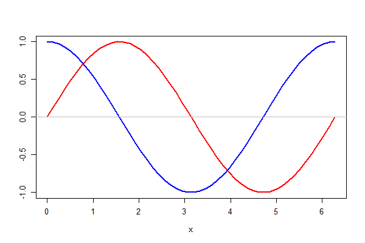

# 函数式编程

- [函数式编程](#函数式编程)
  - [函数定义](#函数定义)
    - [无参函数](#无参函数)
    - [一元函数](#一元函数)
  - [向量化运算](#向量化运算)

2020-08-29, 20:45
@jiawei
***

## 函数定义

使用 `function` 关键字定义函数，一般格式为：

```r
函数名 <- function(形参列表) 函数体
```

使用 `return(x)` 返回 x 值，要返回多个值，可以打包在 list 中。

### 无参函数

例如，定义一个无参的绘图函数：

```r
f <- function() {
  x <- seq(0, 2 * pi, length = 50)
  y1 <- sin(x)
  y2 <- cos(x)
  plot(x, y1, type = 'l', lwd = 2, col = 'red',
       xlab = 'x', ylab = "")
  lines(x, y2, lwd = 2, col = 'blue')
  abline(h = 0, col = 'gray')
}
f()
```



### 一元函数

一元函数，即包含一个参数的函数。其定义十分简单：

```r
f <- function(x) 1 / sqrt(1 + x^2)
```

该函数和数学函数 $f(x)=1/\sqrt{1+x^2}$ 对应。

函数定义中的自变量 `x` 称为形参（formal argument）。函数调用时，为形参提供的参数值称为实参（actual argument）。

## 向量化运算

例如，对下面向量每个元素乘以2，使用 for 循环实现：

```r
> a <- c(2, 4, 3, 1, 5, 7)
> for (i in seq_along(a)) {
+   print(a[i] * 2)
+ }
[1] 4
[1] 8
[1] 6
[1] 2
[1] 10
```

事实上，R支持向量化运算，即将运算符或函数作用于向量的每一个元素，所以可以用向量化代替循环：

```r
> a * 2
[1]  4  8  6  2 10 14
```

达到相同效果，但是更简洁。

再比如，找出 a 中元素大于2的所有值，也可以用向量化操作：

```r
> a[a > 2]
[1] 4 3 5 7
```
