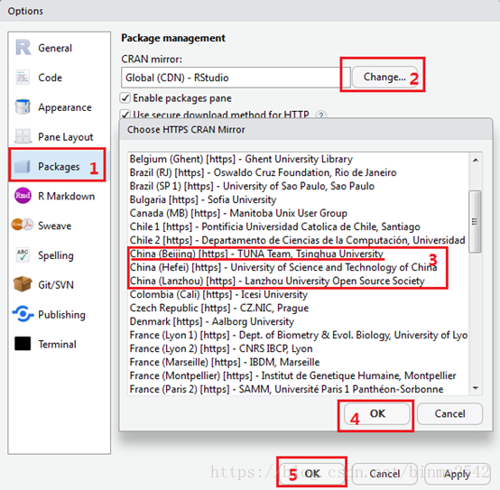

# 包管理

- [包管理](#包管理)
  - [函数](#函数)
  - [简介](#简介)
  - [安装包](#安装包)
    - [选择安装路径](#选择安装路径)
  - [更新包](#更新包)
  - [安装老版本的包](#安装老版本的包)
    - [devtools](#devtools)
  - [GitHub 和 BioConductor](#github-和-bioconductor)
  - [载入包](#载入包)
  - [迁移扩展包](#迁移扩展包)

2020-05-31, 10:07
***

## 函数

|函数|功能|
|---|---|
|install.packages()|安装包。不加参数，显示CRAN镜像站点站点，加包名称，直接下载安装包|
|installed.packages()|列出安装的包|
|update.packages()|更新已安装的包|
|library()|载入包|
|help(package="package_name")|输出某个包的简短描述，以及包中的函数名称和数据集名称的列表|

## 简介

R 包为 R 函数集合。

载入包
R 包在使用前，需要载入当前的 R 环境。载入包命令：

```r
library("package_name", lib.loc = "path to library")
```

安装多个包：

```r
install.packages(c("ggplot2", "devtools", "dplyr"))
```

如果下载太慢，可以设置镜像：




## 安装包

以安装sos包为例。sos 包用来搜索某些函数的帮助文档。 在RStudio中用 **Tools** 菜单的“Install Packages”安装， 输入sos就可以安装该扩展包。

如果不用RStudio， 在 R 图形界面选菜单“程序包-安装程序包”，在弹出的“CRAN mirror”选择窗口中选择一个中国的镜像如 “China (Beijing 2)”， 然后在弹出的“Packages”选择窗口中选择要安装的扩展软件包名称， 即可完成下载和安装。

还可以用如下程序制定镜像网站(例子中是位于清华大学的镜像网站)并安装指定的扩展包：

```r
options(repos=c(CRAN="http://mirror.tuna.tsinghua.edu.cn/CRAN/"))
install.packages("sos")
```

### 选择安装路径

如果权限允许，可以选择安装在R软件的主目录内或者用户自己的私有目录位置。

由于用户对子目录的读写有权限问题，有时不允许一般用户安装扩展包到 R 的主目录中。此时可以用 `.libPaths()`查看允许的扩展包安装位置。

在 `install.packages()` 中用 `lib=` 指定安装位置：

```r
print(.libPaths())
## [1] "D:/R/R-3.3.1/library"
install.packages("sos", lib=.libPaths()[1])
```

## 更新包

```r
update.packages()
```

对每个可更新包，会出现一个弹窗询问是否更新。如果不需要弹窗，直接更新，可以设置：

```r
update.packages(ask = FALSE)
```

## 安装老版本的包

基于兼容或者其它一些原因，可能需要安装老版本的包。实现方式有多种。

### devtools

可以使用 `devtools` 实现该功能：

```

```

## GitHub 和 BioConductor

有一些扩展包没有在CRAN系统提供，而是放在了Github网站。对于这样的包， 安装方法如下：

```r
if(!require(devtools)) install.packages('devtools')
devtools::install_github("kjhealy/socviz")
```

其中 kjhealy 是 Github 网站的某个作者的名称， socviz 是该作者名下的一个R扩展包。

还有一些包需要从Bioconductor网站安装。 示例如下：

```r
if (!requireNamespace("BiocManager", quietly = TRUE))
    install.packages("BiocManager")
BiocManager::install(c("Biostrings"))
```

## 载入包

例如，载入 RWeka 包：

```r
library(RWeka)
```

## 迁移扩展包

在每一次 R 软件更新后，需要重新安装原来的软件包， 这个过程很麻烦。 如果仅仅是小的版本更新， 比如从3.5.1变成3.5.2， 或者从3.4.2变成3.5.0， 可以在安装新版本后， 临时将新版本的 library 子目录更名为 library0， 将老版本的library子目录剪切为新版本的library子目录， 然后将library0中所有内容复制并覆盖进入library子目录， 删除library0即可。 然后在基本R中（不要用RStudio）运行如下命令以更新有新版本的包：

```r
options(repos=c(CRAN="http://mirror.tuna.tsinghua.edu.cn/CRAN/"))
update.packages(checkBuilt=TRUE, ask=FALSE)
```

如果版本改变比较大， 可以用如下方法批量地重新安装原有的软件包。 首先，在更新R软件前，在原来的R中运行：

```r
packages <- .packages(TRUE)
dump("packages", file="packages-20180704.R")
```

这样可以获得要安装的软件包的列表。 在更新R软件后， 运行如下程序：

```r
options(repos=c(CRAN="http://mirror.tuna.tsinghua.edu.cn/CRAN/"))
source("packages-20180704.R")
install.packages(packages)
```

安装时如果提问是否安装需要编译的源代码包， 最好选择否， 因为安装源代码包速度很慢还有可能失败。
