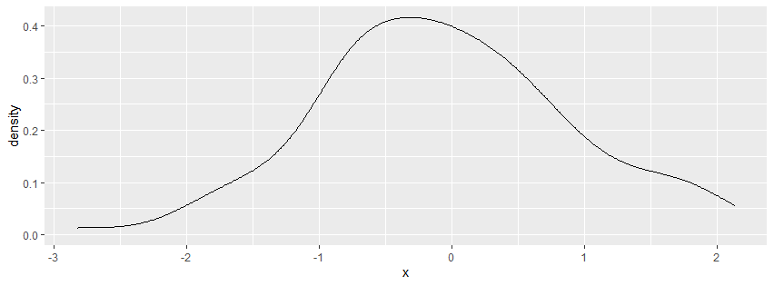
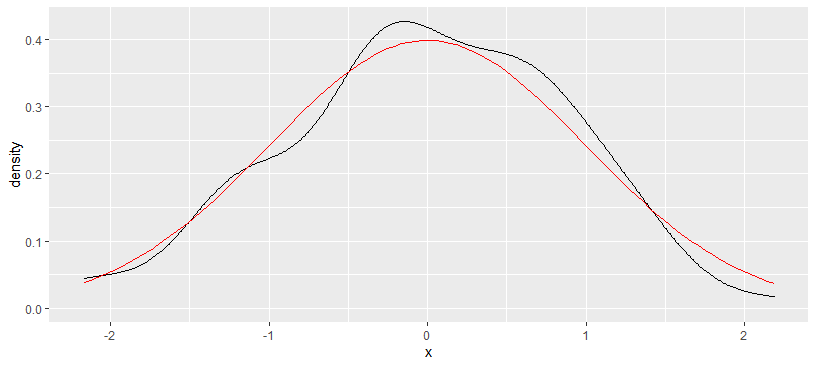

# 模拟与抽样

- [模拟与抽样](#模拟与抽样)
  - [随机数](#随机数)
    - [Uniform](#uniform)

2020-06-16, 15:37
***

## 随机数

`rnorm()` 函数生成正态分布的随机数，例如：

```r
> rnorm(n=5, mean=0, sd=1)
[1]  1.1739663  0.6187899 -0.1127343  0.9170283 -0.2232594
```

R 内置了许多随机数生成函数：

| 分布     | 表示                  | 函数      |
| -------- | --------------------- | --------- |
| Uniform  | $U(a, b)$             | `runif`   |
| Normal   | $N(\mu, \sigma)$      | `rnorm`   |
| Binormal | $Bin(n, p)$           | `rbinorm` |
| Piosson  | $pois(\lambda)$       | `rpois`   |
| Beta     | $Beta(\alpha, \beta)$ | `rbeta`   |

每种分布都有四个函数：

| 函数 | 功能                   |
| ---- | ---------------------- |
| d    | density                |
| p    | cumulative probability |
| q    | quantile               |
| r    | random                 |

- 例如，生成 100 个正态分布的点，然后查看分布：

```r
library(tidyverse)

p <- tibble(
  x = rnorm(n = 100, mean = 0, sd = 1)
) %>% ggplot(aes(x = x)) +
  geom_density()
print(p)
```



下面将模拟的正态分布和理论正态分布画一下：

```r
library(tidyverse)

p <- tibble(
  x = rnorm(n = 100, mean = 0, sd = 1)
) %>% ggplot(aes(x = x)) +
  geom_density() +
  stat_function(
    fun = dnorm,
    args = list(mean = 0, sd = 1),
    color = "red"
  )
print(p)
```



数据点越多，会越接近理论分布。

### Uniform
