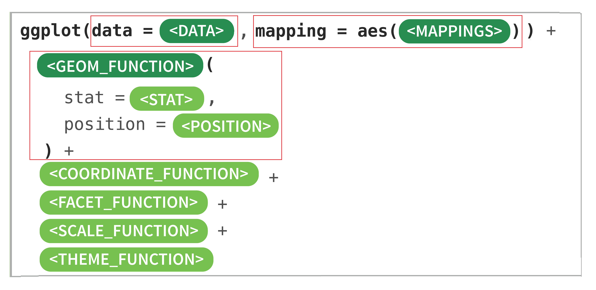
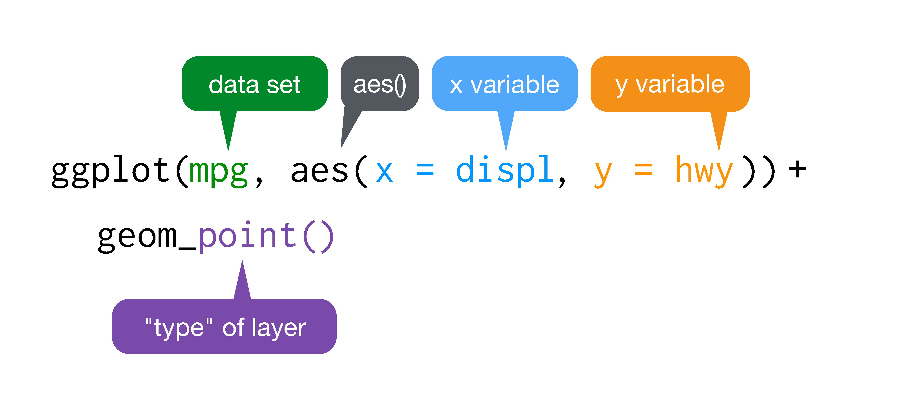
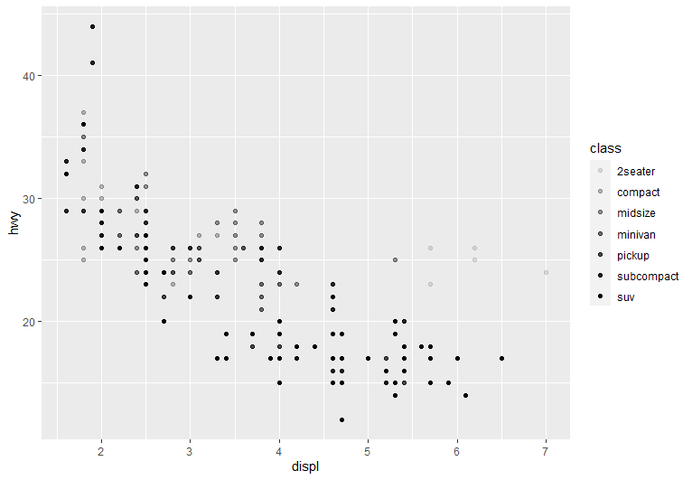
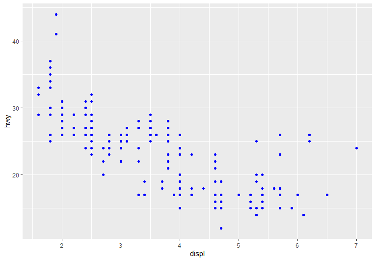
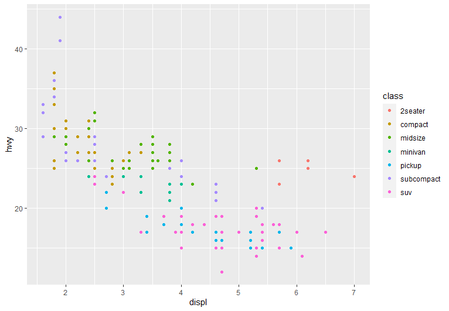
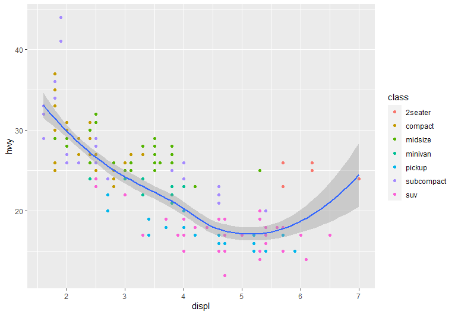
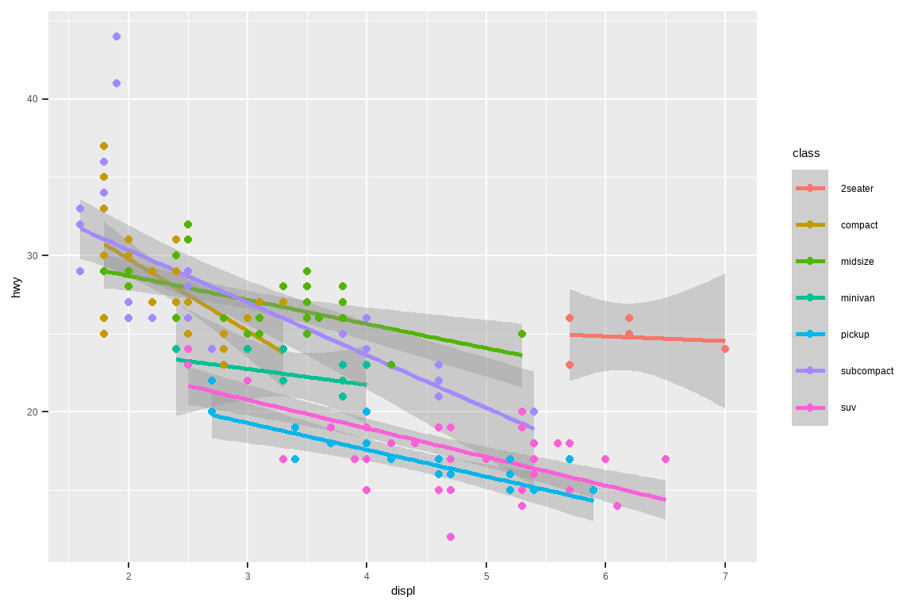
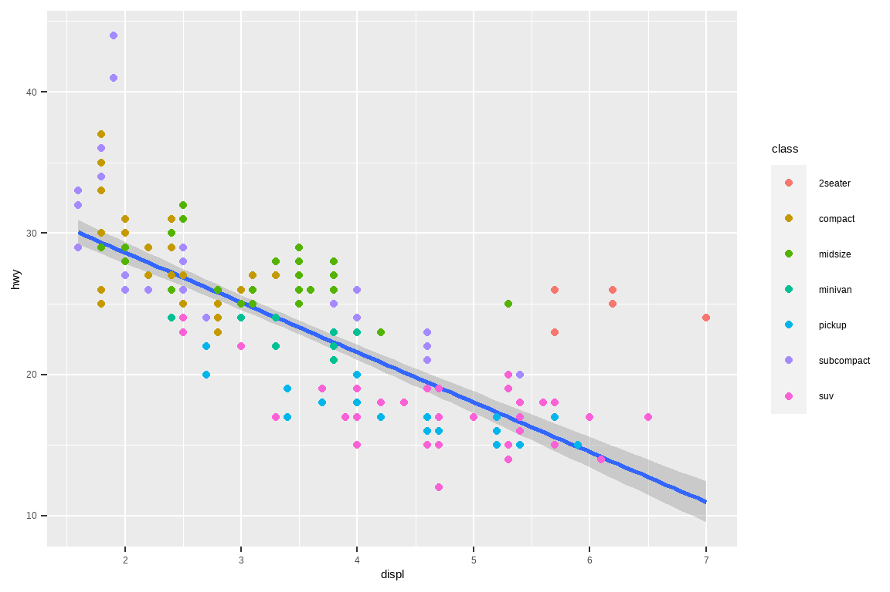

# Introduction

- [Introduction](#introduction)
  - [简介](#简介)
  - [ggplot2 的图形语法](#ggplot2-的图形语法)
    - [语法模板](#语法模板)
  - [映射](#映射)
  - [设置](#设置)
  - [几何对象](#几何对象)
  - [Global vs. Local](#global-vs-local)
  - [导出图片](#导出图片)

2020-05-29, 21:44
*** *

## 简介

ggplot2 是 RStudio 首席科学家 Hadley Wickham 在 2005 年读博期间的作品。

## ggplot2 的图形语法

ggplot2 的 "gg" 表示 grammar of graphics.


`ggplot()` 包括 9 个部分：

- 数据（数据框）
- 映射，mapping
- 几何对象，geom
- 统计变化，stats
- 标度，scale
- 坐标系，coord
- 分面，facet
- 主题，theme
- 存储和输出，output

前三个是必须的。

Hadley Wickham 将其解释为：一张统计图行是从数据到集合对象（geometric object, geom）的图形属性（aesthetic attribute）的映射。

此外，图形中还可能包含数据的统计变化（statistical transformation, stats），最后绘制在某个特定的坐标系中，而分面（facet）用来生成数据不同子集的图形。

### 语法模板



## 映射

以 ggplot2 内置的 mpg 数据演示。

```r
> library(tidyverse)
> str(mpg)
tibble [234 x 11] (S3: tbl_df/tbl/data.frame)
 $ manufacturer: chr [1:234] "audi" "audi" "audi" "audi" ...
 $ model       : chr [1:234] "a4" "a4" "a4" "a4" ...
 $ displ       : num [1:234] 1.8 1.8 2 2 2.8 2.8 3.1 1.8 1.8 2 ...
 $ year        : int [1:234] 1999 1999 2008 2008 1999 1999 2008 1999 1999 2008 ...
 $ cyl         : int [1:234] 4 4 4 4 6 6 6 4 4 4 ...
 $ trans       : chr [1:234] "auto(l5)" "manual(m5)" "manual(m6)" "auto(av)" ...
 $ drv         : chr [1:234] "f" "f" "f" "f" ...
 $ cty         : int [1:234] 18 21 20 21 16 18 18 18 16 20 ...
 $ hwy         : int [1:234] 29 29 31 30 26 26 27 26 25 28 ...
 $ fl          : chr [1:234] "p" "p" "p" "p" ...
 $ class       : chr [1:234] "compact" "compact" "compact" "compact" ...
```

mpg 数据包含 234 行 11 列。如下所示：

|序号|变量|含义|
|---|---|---|
|1|manufacturer|生产厂家|
|2|model|类型|
|3|displ|发动机排量，升|
|4|year|生产年份|
|5|cyl|气缸数量|
|6|trans|传输类型|
|7|drv|驱动类型(f =前轮驱动，r =后轮驱动，4 = 4wd)|
|8|cty|每加仑城市里程|
|9|hwy|每加仑高速公路英里|
|10|fl|汽油种类|
|11|class|类型|

下面就一个问题就行分析：是否汽车的排量越大，油耗越大？

就该问题，需要 mpg 数据集中的三个变量：

- displ, 发动机排量
- hwy, 每加仑英里数，即油耗
- class，汽车类型

```r
> mpg[c('displ', 'hwy', 'class')]
# A tibble: 234 x 3
   displ   hwy class  
   <dbl> <int> <chr>  
 1   1.8    29 compact
 2   1.8    29 compact
 3   2      31 compact
 4   2      30 compact
 5   2.8    26 compact
 6   2.8    26 compact
 7   3.1    27 compact
 8   1.8    26 compact
 9   1.8    25 compact
10   2      28 compact
# ... with 224 more rows
```

为考察发动机排量（displ）与油耗（hwy）的关系，先绘制这两个变量的散点图：



说明：

- `ggplot()` 是用于画图的函数
- `data=mpg` 指定用于画图的数据
- `aes()` 表示数据和图形属性之间的映射

`aes(x=displ, y=hwy)` 意思是变量 `displ` 映射为 x 轴坐标，变量 `hyw` 映射为 y 轴坐标。

另外，`aes()` 除了映射坐标，还可以将数值映射为颜色、形状、透明度等等图形属性。

- `geom_point()` 表示绘制散点图
- `+` 表示添加图层

```r
> ggplot(mpg, aes(x=displ, y=hwy)) + geom_point()
```


下面，我们在 `aes()` 再增加一个映射，将 mpg 的 `class` 映射为颜色，`color=class`。不同汽车类型，用不同颜色的数据点表示：

```r
> ggplot(mpg, aes(x=displ, y=hwy, color=class)) + geom_point()
```


再比如，将 `class` 映射为数据点大小：

```r
> ggplot(mpg, aes(x=displ, y=hwy, size=class)) + geom_point()
```


将 `class` 映射为形状：

```r
> ggplot(mpg, aes(x=displ, y=hwy, shape=class)) + geom_point()
```


将 `class` 映射为透明度：

```r
ggplot(mpg, aes(x=displ, y=hwy, alpha=class)) + geom_point()
```



## 设置

例如，将图形的数据点设置为蓝色：

```r
ggplot(mpg, aes(x=displ, y=hwy)) + geom_point(color="blue")
```



## 几何对象

`geom_point()` 画散点图，`geom_smooth()` 可以绘制平滑曲线。例如：

```r
> p2 <- ggplot(data=mpg, aes(x=displ, y=hwy))+geom_smooth()
> p2
```


散点图加平滑曲线：

```r
p3 <- ggplot(data=mpg, aes(x=displ, y=hwy)) + geom_point() + geom_smooth()
p3
```


## Global vs. Local

例：

```r
ggplot(mpg, aes(x=displ, y=hwy, color=class)) +
    geom_point(aes(x=displ, y=hwy, color=class))
```



或者

```r
ggplot(mpg) +
    geom_point(aes(x=displ, y=hwy, color=class))
```


这两段代码的效果完全一样，不过代码的含义却不同。

如果将映射关系 `aes()` 放在 `ggplot()` 里，此时 `x=displ`, `y=hwy`, `color=class` 为全局变量。

如果将映射关系放在 `geom_point()` 例，就是局部变量。

如果 `geom_point()` 缺少绘图所需的映射关系，会继承全局变量的映射关系。例如：

```r
ggplot(mpg, aes(x=displ, y =hwy))+
    geom_point(aes(color=class))+
    geom_smooth()
```



这里，`geom_point` 和 `geom_smooth` 没有定义映射关系，都是从全局变量继承。

如果局部变量已经定义了映射关系，就不再从全局变量继承。

```r
ggplot(mpg, aes(x = displ, y = hwy, color = class)) +
  geom_smooth(method = lm) +
  geom_point()
```

后面两个图层都完全继承全局变量，所以对每种颜色分类进行了平滑



而下面 `color=class` 只放在散点图，所以平滑曲线对整体进行平滑：

```r
ggplot(mpg, aes(x = displ, y = hwy)) +
  geom_smooth(method = lm) +
  geom_point(aes(color = class))
```



## 导出图片

使用 `ggsave()` 将图片保存为所需格式：

```r
p <- ggplot(mpg, aes(x = displ, y = hwy)) + 
  geom_smooth(method = lm) +
  geom_point(aes(color = class)) +
  ggtitle("This is my first plot")


ggsave(filename = "myfirst_plot.pdf", plot = p, width = 8, height = 6, dpi = 300)
```
