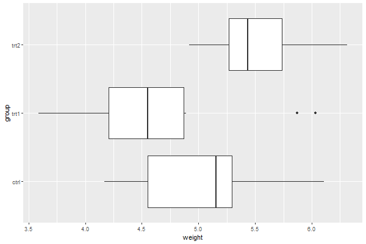

# Axes

- [Axes](#axes)
  - [简介](#简介)
  - [交换 x,y 轴](#交换-xy-轴)
  - [离散坐标轴](#离散坐标轴)
    - [更改x顺序](#更改x顺序)
  - [网格线](#网格线)
    - [隐藏所有网格线](#隐藏所有网格线)
    - [隐藏 minor 网格线](#隐藏-minor-网格线)

2020-08-28, 13:52
@jiaweiM
***

## 简介

下面使用 R 内置数据集 `PlantGrowth` 演示坐标轴相关的设置。

```r
library(ggplot2)

bp <- ggplot(PlantGrowth, aes(x = group, y = weight)) +
  geom_boxplot()
print(bp)
```


## 交换 x,y 轴

使用 `coord_flip()` 交换 x, y 轴位置：

```r
library(ggplot2)

bp <- ggplot(PlantGrowth, aes(x = group, y = weight)) +
  geom_boxplot() +
  coord_flip()
print(bp)
```



## 离散坐标轴

`discrete_scale` 用于定义离散刻度。

```r
discrete_scale(
  aesthetics,
  scale_name,
  palette,
  name = waiver(),
  breaks = waiver(),
  labels = waiver(),
  limits = NULL,
  expand = waiver(),
  na.translate = TRUE,
  na.value = NA,
  drop = TRUE,
  guide = "legend",
  position = "left",
  super = ScaleDiscrete
)
```


### 更改x顺序

`scale_x_discrete()` 用于定义离散数据的 x 刻度。

`scale_x_discrete` 和 `scale_y_discrete` 用于设置离散数据的 x 和 y 轴刻度。不过用 `labs()` 和 `lims()` 设置刻度标签和范围更容易。

```r
scale_x_discrete(..., expand = waiver(), guide = waiver(), position = "bottom")

scale_y_discrete(..., expand = waiver(), guide = waiver(), position = "left")
```

- 设置 x 顺序

```r
bp + scale_x_discrete(limits = c("trt1", "trt2", "ctrl"))
print(bp)
```


## 网格线

### 隐藏所有网格线

```r
library(ggplot2)

bp <- ggplot(PlantGrowth, aes(x = group, y = weight)) +
  geom_boxplot() +
  theme(panel.grid.minor = element_blank(),
        panel.grid.major = element_blank())
print(bp)
```


### 隐藏 minor 网格线

```r
library(ggplot2)

bp <- ggplot(PlantGrowth, aes(x = group, y = weight)) +
  geom_boxplot() +
  theme(panel.grid.minor = element_blank())
print(bp)
```


