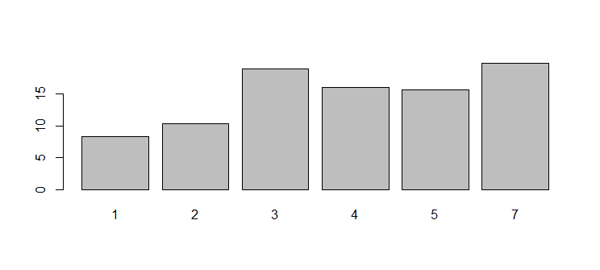
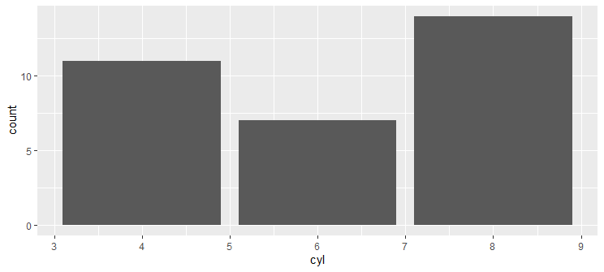

# Bar Graph

- [Bar Graph](#bar-graph)
  - [R barplot](#r-barplot)
  - [ggplot](#ggplot)

2020-06-16, 21:48
***

## R barplot

使用 `barplot()` 绘制条形图。首先来看一下 BOD 数据：

```r
> BOD
  Time demand
1    1    8.3
2    2   10.3
3    3   19.0
4    4   16.0
5    5   15.6
6    7   19.8
```

使用向量给 `barplot()` 提供数据，如果是命名向量，则向量名称自动作为条形图的标签。

```r
barplot(BOD$demand, names.arg = BOD$Time)
```



条形图和直方图很像，不过其 x 坐标是离散的，一般用作分类变量。

使用 `table()` 函数可以获得向量 unique 值的个数：

```r
> table(mtcars$cyl)

 4  6  8
11  7 14
```

绘制条形图：

```r
# Generate a table of counts
barplot(table(mtcars$cyl))
```

## ggplot

ggplot2 使用 `geom_col()` 绘制条形图。

```r
p <- ggplot(BOD, aes(x = Time, y = demand)) +
  geom_col()
print(p)
```


此处，x 是作为连续数据处理，所以在 X=6 处没有值，所以矩形高度为 0.

可以将其转换为 factor，称为离散型变量：

```r
# Convert the x variable to a factor, so that it is treated as discrete
ggplot(BOD, aes(x = factor(Time), y = demand)) +
  geom_col()
```


ggplot2 还可以用来不同分类的分布，此时用 `geom_bar()`。此时也需要注意离散变量和连续变量的差异。

```r
# Bar graph of counts. This uses the mtcars data frame, with the 'cyl' column for
# x position. The y position is calculated by counting the number of rows for
# each value of cyl.
ggplot(mtcars, aes(x = cyl)) +
  geom_bar()
```



转换为离散变量：

```r
p <- ggplot(mtcars, aes(x = factor(cyl))) +
  geom_bar()
```


