# Bar Graph

- [Bar Graph](#bar-graph)
  - [简介](#简介)
  - [R barplot](#r-barplot)
  - [ggplot](#ggplot)
  - [数据变换](#数据变换)
  - [颜色映射](#颜色映射)
  - [分段与并列条形图](#分段与并列条形图)
  - [Grouping Bars](#grouping-bars)
  - [Count Bar](#count-bar)
  - [Color](#color)

2020-06-16, 21:48
***

## 简介

Bar Graph 是简单的二维图，x 表示每个 bar 的位置，y 表示 bar 的高度。

## R barplot

使用 `barplot()` 绘制条形图。首先来看一下 BOD 数据：

```r
> BOD
  Time demand
1    1    8.3
2    2   10.3
3    3   19.0
4    4   16.0
5    5   15.6
6    7   19.8
```

使用向量给 `barplot()` 提供数据，如果是命名向量，则向量名称自动作为条形图的标签。

```r
barplot(BOD$demand, names.arg = BOD$Time)
```


条形图和直方图很像，不过其 x 坐标是离散的，一般用作分类变量。

使用 `table()` 函数可以获得向量 unique 值的个数：

```r
> table(mtcars$cyl)

 4  6  8
11  7 14
```

绘制条形图：

```r
# Generate a table of counts
barplot(table(mtcars$cyl))
```

## ggplot

有些 `geom_xxx()` 函数直接按照数据值作图， 如 `geom_point()`、`geom_line()`， 而 `geom_smooth()` 这样的函数则会按照某种算法计算并对计算结果作图。`geom_xxx()` 都有默认的 `stat_xxx()` 函数用来计算，也可以人为指定不同的统计规则。

ggplot2 有两种条形图：`geom_bar()` 和 `geom_col()`:

- `geom_bar` 中 bar 的高度和分组中 count 数成正比，如果提供了 `weight`，则和 weights 的加和成正比。
- 如果希望 bar 的高度表示数据，使用 `geom_col()`。

`geom_bar()` 默认使用 `stat_count()`，即计算各个值出现的次数。

`geom_col()` 使用 `stat_identity()`，即不做任何改变。

ggplot2 使用 `geom_col()` 绘制条形图。下面先看一个简单的数据：

```r
> pg_mean
  group weight
1  ctrl  5.032
2  trt1  4.661
3  trt2  5.526
```

```r
p <- ggplot(pg_mean, aes(x = group, y = weight)) +
  geom_col()
print(p)
```

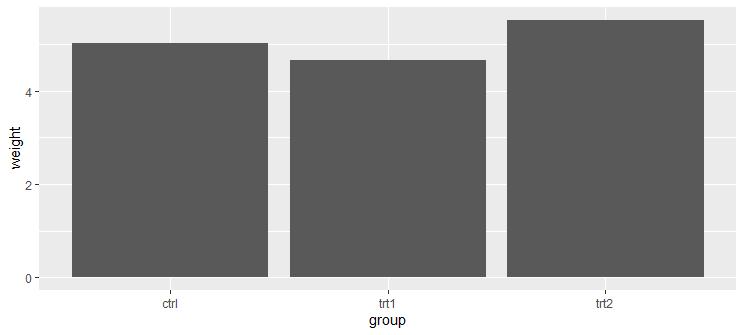

如果 x 是连续型变量，`geom_col()` 不是在每个 x 处添加 bar，而是在最大值和最小值范围内每个可能的 x 处都添加 bar。例如：

```r
p <- ggplot(BOD, aes(x = Time, y = demand)) +
  geom_col()
print(p)
```

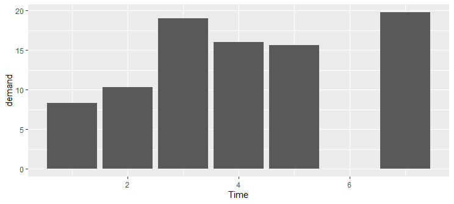

此处，x 是作为连续数据处理，虽然在 X=6 处没有值，还是添加了高度为 0 的矩形.

可以通过将其转换为 factor，转换成离散型变量：

```r
# Convert the x variable to a factor, so that it is treated as discrete
ggplot(BOD, aes(x = factor(Time), y = demand)) +
  geom_col()
```

这样就没有 `x=6` 出的矩形。

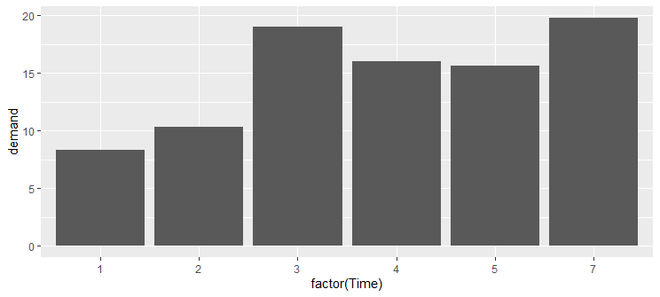

ggplot2 还可以用来不同分类的分布，此时用 `geom_bar()`。此时也需要注意离散变量和连续变量的差异。

```r
# Bar graph of counts. This uses the mtcars data frame, with the 'cyl' column for
# x position. The y position is calculated by counting the number of rows for
# each value of cyl.
ggplot(mtcars, aes(x = cyl)) +
  geom_bar()
```


转换为离散变量：

```r
p <- ggplot(mtcars, aes(x = factor(cyl))) +
  geom_bar()
```

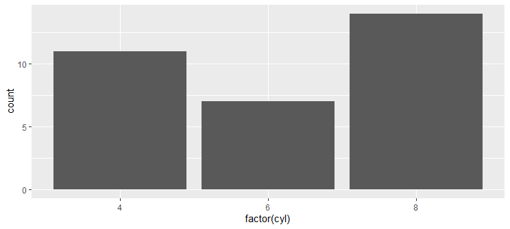

bar 的颜色默认为黑灰色。可以使用 `fill` 指定颜色。并且默认没有边框，可以使用 `colour` 添加边框，如下所示，填充浅蓝色、黑边框：

```r
p <- ggplot(pg_mean, aes(x = group, y = weight)) +
  geom_col(fill = "lightblue", color = "black")
print(p)
```

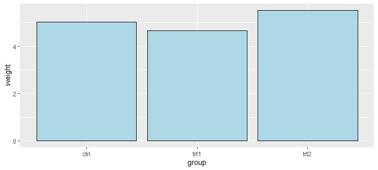

## 数据变换

下面使用 socviz 包中的 gss_sm 数据集作图。

`geom_bar()` 可以对一个分类变量自动统计频数，并作频数条形图。比如 `gss_sm` 数据集的 biregion 变量作频数条形图：

```r
library(tidyverse)
library(socviz)

p <- ggplot(
  data = gss_sm,
  mapping = aes(x = bigregion)
)

gp <- p+geom_bar()
print(gp)
```

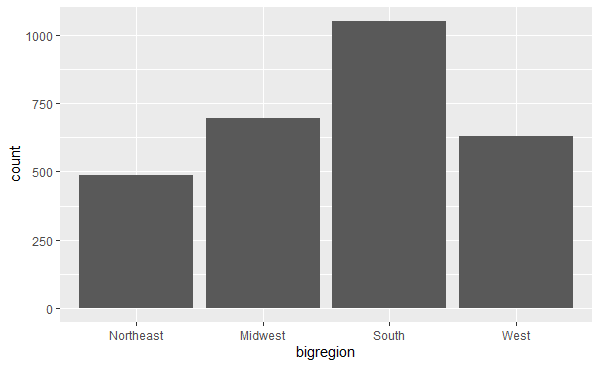

结果是每个大区的受访人数的条形图。图形中 x 映射是用户指定的，而 y 轴则是自动计算的频数。生成新变量 count 和 prop。`geom_bar()` 默认使用 count (频数)。

虽然ggplot2能够自动统计频数，但最好还是预先统计好频数，仅用ggplot2绘图。 所以，上例可以用tidyverse的count和ggplot2的 `geom_col` 改写成：

```r
library(tidyverse)
library(socviz)

df1 <- gss_sm %>%
  select(bigregion) %>%
  count(bigregion) %>%
  mutate(ratio = n / sum(n))

p <- ggplot(
  data = df1,
  mapping = aes(x = bigregion, y = n)
)
gp <- p + geom_col() +
  labs(y = "Count")
print(gp)
```


```r
p <- ggplot(
  data = df1,
  mapping = aes(x = bigregion, y = ratio)
)
print(p + geom_col() + labs(y = "Ratio"))
```

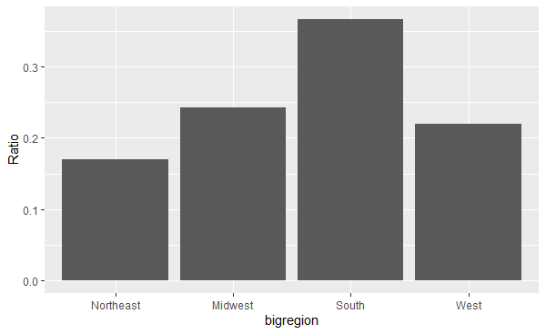

## 颜色映射

下面以 gss_sm 数据集中的 religion 变量的频数作条形图，并给不同的条形自动分配不同的颜色，指定 `fill=religion` 即可：

```r
library(tidyverse)
library(socviz)

df2 <- gss_sm %>%
  select(religion) %>%
  count(religion)

p <- ggplot(
  data = df2,
  mapping = aes(
    x = religion,
    y = n,
    fill = religion
  )
)

print(p + geom_col() + labs(y = "Count"))
```

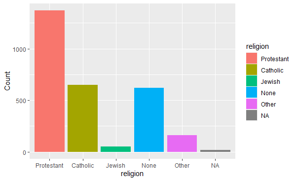

因为将 religion 同时映射到 x 与 fill，所以对应的 fill 在图形右侧出现了图例，这是多余的。调用 `guides(fill = FALSE)` 可以认为指定不做关于填充色的图例：

```r
> df2 <- gss_sm %>%
+   select(religion) %>%
+   count(religion)
>
> p <- ggplot(
+   data = df2,
+   mapping = aes(
+     x = religion,
+     y = n,
+     fill = religion
+   )
+ )
>
> p + geom_col() +
+   guides(fill = FALSE) +
+   labs(y = "Count")
```

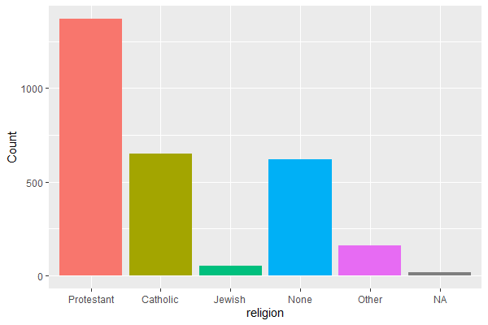

从可视化理论的角度看，上图中的颜色是多余的。

## 分段与并列条形图

两个分类变量的交叉频数分布可以用分段条形图或者并列条形图表示。对相同 x 位置的多个 bars，有多种处理方式：

|函数|参数|说明|
|---|----|---|
|`position_stack()`|'stack'|默认值，即堆叠在一起|
|`position_dodge()`|'dodge'|水平排列|
|`position_dodge2()`|'dodge2'|用于箱线图的特殊 dodge|
|`position_fill()`|'fill'|堆叠后归一化高度，使得每个总高度相同|

例如，对 gss_sm 数据集，按照 bigregion 分组，每组再按照 re

## Grouping Bars

将一个分类变量映射到 `fill`，并设置 `geom_col(position='dodge')`，可以创建分组 bar。

下面使用 `cabbage_exp` 数据集：

```r
> cabbage_exp
  Cultivar Date Weight        sd  n         se
1      c39  d16   3.18 0.9566144 10 0.30250803
2      c39  d20   2.80 0.2788867 10 0.08819171
3      c39  d21   2.74 0.9834181 10 0.31098410
4      c52  d16   2.26 0.4452215 10 0.14079141
5      c52  d20   3.11 0.7908505 10 0.25008887
6      c52  d21   1.47 0.2110819 10 0.06674995
```

```r
p <- ggplot(cabbage_exp, aes(x = Date, y = Weight, fill = Cultivar)) +
  geom_col(position = "dodge")
print(p)
```

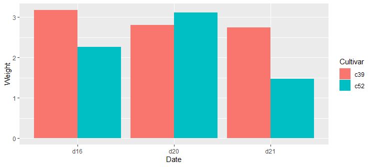

在 `geom_col()` 中设置 `colour = 'black'` 可以添加黑色边框。

使用 `scale_fill_brewer()` 或 `scale_fill_manual()` 可以设置颜色。

例如：

```r
p <- ggplot(cabbage_exp, aes(x = Date, y = Weight, fill = Cultivar)) +
  geom_col(position = "dodge", colour = "black") +
  scale_fill_brewer(palette = "Pastel1")
print(p)
```

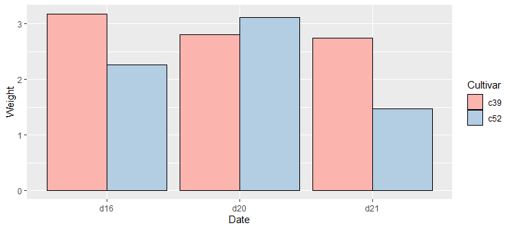

对分组 columns，如果某个组合缺失一个，另一个 bar 会扩宽以填充余下空间。

例如，我们移除 `cabbage_exp` 的最后一行，然后绘图：

```r
ce <- cabbage_exp[1:5, ]
p <- ggplot(ce, aes(x = Date, y = Weight, fill = Cultivar)) +
  geom_col(position = "dodge", colour = "black") +
  scale_fill_brewer(palette = "Pastel1")
```

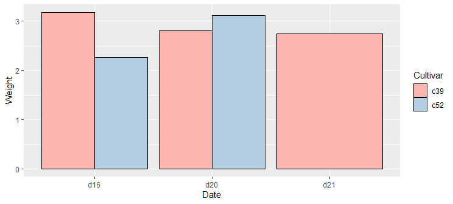

对这种情况，可以手动确实的值，对 y 设置为 `NA` 即可。

## Count Bar

假如你只有一列数据，你想统计其中各个值出现的次数，绘制条形图，此时可以用 `geom_bar()`。例如，对数据集 diamonds:

```r
> diamonds
# A tibble: 53,940 x 10
   carat cut       color clarity depth table price     x     y     z
   <dbl> <ord>     <ord> <ord>   <dbl> <dbl> <int> <dbl> <dbl> <dbl>
 1 0.23  Ideal     E     SI2      61.5    55   326  3.95  3.98  2.43
 2 0.21  Premium   E     SI1      59.8    61   326  3.89  3.84  2.31
 3 0.23  Good      E     VS1      56.9    65   327  4.05  4.07  2.31
 4 0.290 Premium   I     VS2      62.4    58   334  4.2   4.23  2.63
 5 0.31  Good      J     SI2      63.3    58   335  4.34  4.35  2.75
 6 0.24  Very Good J     VVS2     62.8    57   336  3.94  3.96  2.48
 7 0.24  Very Good I     VVS1     62.3    57   336  3.95  3.98  2.47
 8 0.26  Very Good H     SI1      61.9    55   337  4.07  4.11  2.53
 9 0.22  Fair      E     VS2      65.1    61   337  3.87  3.78  2.49
10 0.23  Very Good H     VS1      59.4    61   338  4     4.05  2.39
# ... with 53,930 more rows
```

该数据集有 53,940 行，每一行是一个 diamond 的信息。

统计 `cut` 各个值出现的次数，绘图：

```r
p <- ggplot(diamonds, aes(x = cut)) +
  geom_bar()
```

`stat` 参数有两个选项：

- `bin`，将数据分为不同范围，计算每个范围内的个数
- `count`，计算每个 x 值的个数。


## Color

将变量映射到 `fill` 属性。

