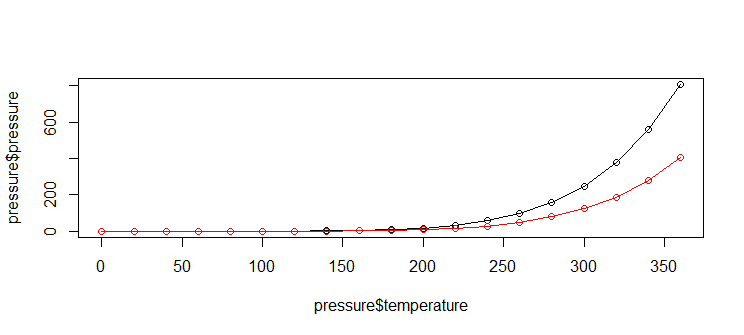

# Line Chart

- [Line Chart](#line-chart)
  - [plot](#plot)
  - [ggplot](#ggplot)

2020-06-16, 21:27
***

## plot

使用 `plot()` 绘制线图，需要设置 `type = 'l'`:

```r
plot(pressure$temperature, pressure$pressure, type = 'l')
```


如果要同时添加散点图和线图，可以先用 `plot()` 添加线图，然后用 `points()` 和 `lines()` 添加额外的图：

```r
plot(pressure$temperature, pressure$pressure, type = "l")
points(pressure$temperature, pressure$pressure)

lines(pressure$temperature, pressure$pressure / 2, col = "red")
points(pressure$temperature, pressure$pressure / 2, col = "red")
```



## ggplot

使用 ggplot2 的 `geom_line()` 可以获得线图：

```r
ggplot(pressure, aes(x = temperatur, y = pressure)) +
  geom_line()
```


散点图+线图：

```r
ggplot(pressure, aes(x = temperature, y = pressure)) +
  geom_line() +
  geom_point()
```


